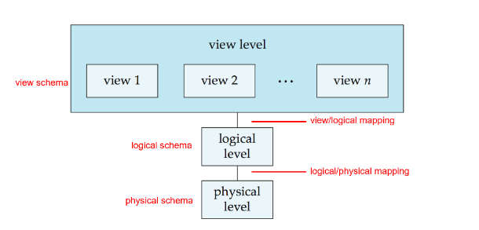

# 1 Database Systems
Applications (应用软件)可以建立在files上，也可以建立在databases（更好的翻译：数据基地）上。

* DBMS (Database Management System)

Database Application: 数据库应用，数据库应用系统
直观感受：就是一堆表格，各种各样的表格
# 2 Purpose of Database Systems
数据库系统旨在解决下面的问题（将database application直接建立在file systems之上产生的问题）：
1. **data redundancy (数据冗余) and inconsistency** ：Multiple file formats, duplication of information in different files 同一个信息在不同地方存着
2. **data isolation (数据孤立，数据孤岛)** ：由于格式等问题，不同文件之间没有关联，很难综合集成
3. **difficulty in accessing data (存取数据困难)** : 每一个特定的访问都要写一个新的筛选程序
4. **integrity problems (完整性问题)** ：数据必须满足一定的约束条件(integrity constraints); Integrity constraints become "buried" in program code rather than being stated explicitly. 完整的约束条件被藏在数据和代码中，而不是显式地声明。数据库系统会对于插入的数据进行检测，如果不满足这些蕴含的约束条件，则会拒绝。比如一个约束条件 account balance >=1 账号余额大于等于1，这会直接蕴含于数据库的定义中，而不是在程序中反复声明。
5. **atomicity problems (原子性问题)**：Failures may leave database in an inconsistent state with partial updates carried out . 比如银行转账，一端的转入和另一端的转出是一个不可分割的原子，partial updates 就是一端转出了另一端还没转入。在数据库系统中，可以定义哪些操作是原子化的，当一端已经update但是另一端无法进行update的时候，数据库系统会自动把前面的操作撤销。
6. **concurrent access anomalies (并发访问异常)** ：Uncontrolled concurrent accesses can lead to inconsistencies
   
   两个几乎同时的转账操作会导致只转入了一个50。
7. **security problems** : 
     1) Hard to provide user access to some, but not all, data
     2) Authentication (认证)
     3) Priviledge (权限)
     4) Audit (审计) 管理员等的操作会被记录

# 3 Characteristisc of Databases
* data persistence (数据持久性)
*  convenience in accessing data (数据访问便利性)
* data integrity(数据完整性)
* concurrency control for multiple user (多用户并发控制)
* failure recovery (故障恢复)
* security control (安全控制)
# 4 View of Data
